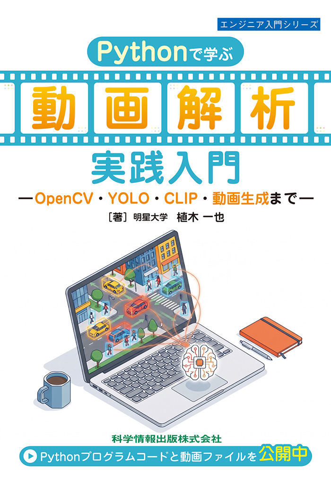

# Pythonで学ぶ動画解析 実践入門

本リポジトリでは，書籍  
**『Pythonで学ぶ動画解析 実践入門 ― OpenCV・YOLO・CLIP・動画生成まで ―』**  
（植木 一也 著，科学情報出版，2026年）のサンプルプログラムを公開しています．

  

PythonとOpenCVを用いた動画解析の基礎から，物体検出・追跡，行動認識，
マルチモーダルAI，動画生成まで，本書で扱う内容を実際に動かしながら学ぶことができます．

📘 **書籍の詳細・購入ページ**  
https://techs-labo.jp/service/it-book/books/182.html

🏠 **著者・研究室ホームページ**  
https://kenkyu.hino.meisei-u.ac.jp/ueki-lab/

---

## サンプルプログラムについて

本書で使用するサンプルコードを章ごとに収録しています．

実行に必要なデータについても，可能な範囲で各ディレクトリに収録しています．

各プログラムの詳細や実行方法については，本書および各ディレクトリの説明をご覧ください．
